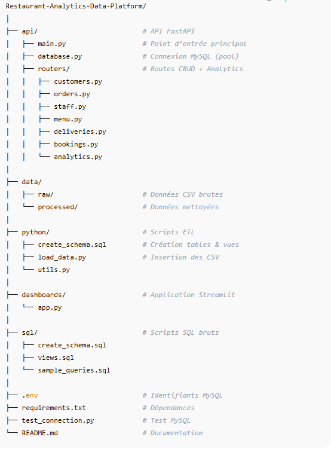

##  Présentation de l’entreprise

**NDAO & Frères** est un restaurant familial sénégalais fondé à Dakar en 2015.
Situé entre tradition et modernité, il propose une cuisine authentique inspirée des recettes locales — thiéboudienne, yassa, mafé, poisson grillé — tout en intégrant une touche contemporaine dans la présentation et le service.

Grâce à une forte réputation bâtie sur la qualité, la convivialité et l’expérience client, le restaurant a connu une croissance rapide, ouvrant deux nouvelles succursales à Thiès et Saint-Louis, et lançant récemment un service de commande en ligne et de livraison à domicile.

Cependant, cette expansion a également créé de nouveaux défis liés à la gestion et l’exploitation des données.

## Problématique métier

Malgré son succès, **NDAO & Frères** fait face à plusieurs difficultés dans la gestion quotidienne de ses opérations :
- Les données provenant des **réservations**, **commandes**, **stocks**, **livraisons** et **clients** sont éparpillées entre différents systèmes (Excel, WhatsApp Business, caisse locale, notes manuelles).
- Les **rapports de ventes et de performance** sont produits manuellement chaque fin de semaine, entraînant des retards et des erreurs.
- L’absence d’une **vision consolidée** empêche la direction de suivre en temps réel :
    - les plats les plus rentables,
    - la productivité du personnel,
    - les pics d’activité,
    - ou encore la satisfaction client.

En clair, NDAO & Frères dispose d’une mine d’informations, mais aucun système centralisé ne permet de les exploiter efficacement.

## Objectif du projet

Le projet NDAO & Frères Data Analytics Platform vise à construire une plateforme cloud moderne et automatisée pour collecter, centraliser, transformer et analyser toutes les données stratégiques du restaurant.

L’objectif est de permettre à la direction :
- d’avoir une **vue unifiée** et fiable de l’activité en temps réel ;
- de piloter la **performance commerciale et opérationnelle** ;
- de mieux comprendre **le comportement des clients** ;
- et de **prendre des décisions éclairées** pour optimiser les coûts, la satisfaction et la rentabilité.

## Architecture du projet

## Description de l’API
### Présentation générale

L’**API REST Restaurant Analytics** est un service conçu pour exposer les données opérationnelles du restaurant NDAO & Frères de manière centralisée, fiable et performante.
Elle permet d’interagir directement avec la base MySQL et de piloter toutes les composantes clés du restaurant : clients, commandes, menus, réservations, livraisons et personnel.

L’API est entièrement documentée grâce à Swagger UI et OpenAPI 3.1, accessibles localement à l’adresse : http://127.0.0.1:8000/docs

### Fonctionnalités principales :
- **Clients** : créer, lister, modifier ou supprimer les clients enregistrés  
- **Commandes** : suivre les commandes, montants totaux, et plats associés  
- **Personnel** : consulter les employés, leurs rôles et leurs performances  
- **Livraisons** : visualiser les livraisons, statuts et livreurs  
- **Réservations** : suivre les réservations et taux d’occupation  
- **Analytique** : exploiter des vues SQL pour suivre :
  - les ventes par plat   
  - la performance du personnel   
  - les statistiques de livraison  
  - les réservations mensuelles  

### Données exposées :
Les endpoints REST couvrent :
| Domaine | Exemple d’endpoint | Description |
|----------|--------------------|--------------|
| **Clients** | `/customers/` | CRUD complet sur les clients |
| **Commandes** | `/orders/` | Suivi des ventes et revenus |
| **Menu** | `/menu/` | classement des plats les plus vendus et rentables | 
| **Livraisons** | `/deliveries/` | Suivi des livraisons et statuts |
| **Réservations** | `/bookings/` | Gestion des réservations |
| **Analytique** | `/analytics/sales-by-menu` | Vues consolidées SQL |

---

### Bon à savoir :
- Tous les endpoints supportent la **pagination** (`skip`, `limit`)  
- Des **filtres dynamiques** sont disponibles selon les routes  
- Vous pouvez tester directement toutes les routes via l’interface Swagger  `/docs`  
- En cas d’erreur (ex : ID inexistant), une **réponse JSON structurée** est retournée avec le bon code HTTP

---

### Stack technique :
- **FastAPI** — framework asynchrone moderne  
- **MySQL 8** — base de données relationnelle  
- **Pydantic** — validation stricte des modèles  
- **Uvicorn** — serveur ASGI rapide et léger  
- **Streamlit (à venir)** — tableau de bord analytique  

---

## Installation et exécution

- Python ≥ 3.10
- MySQL ≥ 8.0
- VS Code / Jupyter Notebook

1. Cloner le projet
git clone https://github.com/psndao/Restaurant-Analytics-Data-Platform.git
cd Restaurant-Analytics-Data-Platform

2. Installer les dépendances
pip install -r requirements.txt

3. Configurer l’environnement
cp .env.example .env
puis éditer les valeurs : DB_USER, DB_PASSWORD, DB_NAME, etc.

4. Tester la connexion
python main.py

5. Lancer l’API
uvicorn api.main:app --reload

